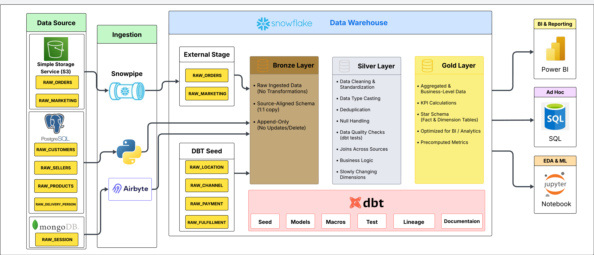
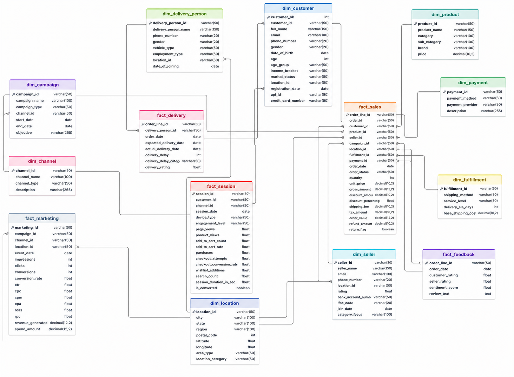

# E-commerce analytics platform using Medallion Architecture

## Overview

This project implements an end-to-end modern data warehouse pipeline using a Medallion Architecture (Bronze → Silver → Gold) on Snowflake, integrated with robust ingestion, transformation, and analytics layers. The goal is to enable scalable, reliable, and analytics-ready data for BI, ad-hoc querying, and data science workloads.

## Project Architecture

## Tools & Technologies

| Category                | Tools / Technologies                                      | Purpose |
|------------------------|-----------------------------------------------------------|--------|
| **Architecture Type**   | Modern ELT, Medallion Architecture (Bronze-Silver-Gold), Cloud Data Platform | Scalable, layered data processing and analytics architecture |
| **Data Sources**        | AWS S3, PostgreSQL, MongoDB                              | Store raw structured and unstructured data |
| **Ingestion**           | Snowpipe, Airbyte, Python                                | Automated data ingestion and pipeline execution |
| **Staging Layer**       | Snowflake External Stage                                 | Landing zone for raw ingested data |
| **Data Warehouse**      | Snowflake                                                | Centralized cloud data warehouse |
| **Transformation**      | dbt (Data Build Tool), SQL                               | Data transformation, modeling, and business logic |
| **Data Layers**         | Bronze Layer                                             | Raw, append-only data |
|                        | Silver Layer                                             | Cleaned, standardized, deduplicated data |
|                        | Gold Layer                                               | Aggregated, analytics-ready data |
| **Python Libraries**    | pandas, NumPy, SQLAlchemy                                | Data manipulation, processing, database connectivity |
|                        | matplotlib, seaborn                                      | Data visualization and EDA |
|                        | scikit-learn                                             | Machine learning and predictive modeling |
|                        | requests                                                 | API integration and data fetching |
| **Data Modeling**       | dbt Models, Seeds, Macros                               | Schema design and reusable transformations |
| **Data Quality**        | dbt Tests                                                | Data validation and integrity checks |
| **Orchestration Logic** | Python, SQL                                              | Workflow logic and transformations |
| **Analytics & BI**      | Power BI                                                 | Dashboards and reporting |
| **Ad-hoc Analysis**     | SQL                                                      | Query-based exploration |
| **EDA & ML**            | Jupyter Notebook                                         | Exploratory data analysis and ML workflows |
| **Data Governance**     | dbt Lineage, Documentation                              | Data lineage tracking and documentation |

##  Raw Layer Data (Source Tables Overview)

| Category            | Table Name        | Key Fields / Attributes                                                                 | Description |
|--------------------|------------------|------------------------------------------------------------------------------------------|------------|
| **Customer Data**   | RAW_CUSTOMERS    | CUSTOMER_ID, FIRST_NAME, LAST_NAME, EMAIL, PHONE_NUMBER, GENDER, DOB, LOCATION_ID       | Stores customer demographic and personal information |
| **Order Data**      | RAW_ORDERS       | ORDER_ID, CUSTOMER_ID, PRODUCT_ID, QUANTITY, ORDER_DATE, STATUS, PAYMENT_ID             | Contains transactional order-level data |
| **Product Data**    | RAW_PRODUCTS     | PRODUCT_ID, PRODUCT_NAME, CATEGORY, SUB_CATEGORY, PRICE, BRAND                          | Product catalog and pricing details |
| **Seller Data**     | RAW_SELLERS      | SELLER_ID, SELLER_NAME, EMAIL, PHONE_NUMBER, LOCATION_ID, RATING                        | Seller profile and performance data |
| **Session Data**    | RAW_SESSIONS     | SESSION_ID, CUSTOMER_ID, CHANNEL_ID, PAGE_VIEWS, PRODUCT_VIEWS, ADD_TO_CART, PURCHASES  | User interaction and behavioral tracking |
| **Marketing Data**  | RAW_MARKETING    | CAMPAIGN_ID, CHANNEL_ID, CLICKS, IMPRESSIONS, CONVERSIONS, REVENUE                      | Marketing campaign performance metrics |
| **Payment Data**    | RAW_PAYMENT      | PAYMENT_ID, PAYMENT_METHOD, PAYMENT_PROVIDER                                             | Payment transaction methods and providers |
| **Fulfillment Data**| RAW_FULFILLMENT  | FULFILLMENT_ID, SHIPPING_METHOD, SERVICE_LEVEL, DELIVERY_SLA_DAYS, BASE_SHIPPING_COST   | Shipping and fulfillment details |
| **Delivery Data**   | RAW_DELIVERY     | DELIVERY_PERSON_ID, NAME, PHONE_NUMBER, VEHICLE_TYPE, LOCATION_ID                        | Delivery personnel information |
| **Location Data**   | RAW_LOCATION     | LOCATION_ID, CITY, STATE, REGION, LATITUDE, LONGITUDE                                   | Geographical and regional mapping data |
| **Channel Data**    | RAW_CHANNEL      | CHANNEL_ID, CHANNEL_NAME, CHANNEL_TYPE                                                   | Sales/marketing channel classification |

##  ER Model of Gold Layer Tables
