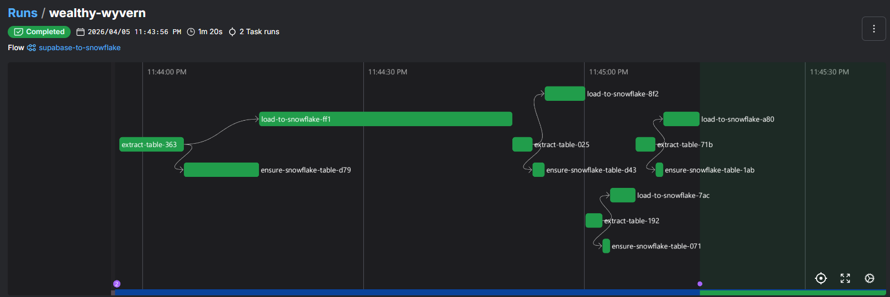

# E-commerce analytics platform using Medallion Architecture

## 🎯 Business Problem Statement
 
E-commerce businesses generate data across dozens of siloed systems — order management, customer CRM, marketing platforms, delivery operations, and session tracking. Without a unified data platform, teams face:
 
- **No single source of truth** — marketing, operations, and finance teams work from inconsistent numbers
- **Delayed insights** — reports take days to compile manually from disconnected systems
- **Poor customer understanding** — customer behaviour, lifetime value, and churn signals are invisible without joined data
- **Marketing waste** — campaign ROI is impossible to measure without linking spend to actual conversions and revenue
- **Operational blind spots** — delivery SLA breaches and fulfilment failures go undetected until they escalate
This project solves all of the above by building a **centralised, automated, analytics-ready data platform** that unifies 11 source tables across 3 heterogeneous databases into a single Snowflake warehouse — with clean, governed, BI-ready data available within minutes of ingestion.
 
---
 
## 🎯 Project Goals
 
| # | Goal | Outcome |
|---|------|---------|
| 1 | Unify all e-commerce data sources into a single warehouse | ✅ Snowflake as the central platform |
| 2 | Automate ingestion from S3, PostgreSQL, MongoDB | ✅ Snowpipe + Python + Airbyte |
| 3 | Apply Medallion Architecture for progressive data quality | ✅ Bronze → Silver → Gold layers |
| 4 | Build a governed, tested transformation layer | ✅ dbt models, tests, macros, documentation |
| 5 | Produce analytics-ready Gold layer datasets | ✅ Star schema fact & dimension tables |
| 6 | Surface KPIs in a self-serve BI dashboard | ✅ Power BI ECOMMERCE.pbix |
| 7 | Enable ad-hoc SQL analysis and EDA | ✅ SQL summaries + Jupyter notebooks |
| 8 | Lay groundwork for ML & predictive analytics | ✅ scikit-learn experimentation |
 
---


## Project Architecture


**Step-by-step flow:**
 
1. **Raw data lands** in AWS S3 (orders, marketing), PostgreSQL (customers, sellers, products, delivery), and MongoDB (sessions)
2. **Snowpipe** auto-triggers on S3 file events → loads into Snowflake External Stage → `COPY INTO` Bronze tables
3. **Python scripts** extract and load PostgreSQL tables (customers, sellers, products, delivery) directly into the Bronze layer
4. **Airbyte** syncs MongoDB session documents into the Bronze layer on a schedule
5. **dbt Seeds** load static lookup tables (location, channel, payment, fulfilment) into Bronze
6. **dbt Silver models** clean, standardise, cast, deduplicate, and apply business logic
7. **dbt Gold models** join across domains, compute KPIs, and build the Star Schema
8. **Power BI** connects to Gold layer for dashboards; Jupyter notebooks and SQL queries access Gold for EDA and ad-hoc analysis


## Tools & Technologies

| Category                | Tools / Technologies                                      | Purpose |
|------------------------|-----------------------------------------------------------|--------|
| **Architecture Type**   | Modern ELT, Medallion Architecture (Bronze-Silver-Gold), Cloud Data Platform | Scalable, layered data processing and analytics architecture |
| **Data Sources**        | AWS S3, PostgreSQL, MongoDB                              | Store raw structured and unstructured data |
| **Ingestion**           | Snowpipe, Airbyte, Python                                | Automated data ingestion and pipeline execution |
| **Staging Layer**       | Snowflake External Stage                                 | Landing zone for raw ingested data |
| **Data Warehouse**      | Snowflake                                                | Centralized cloud data warehouse |
| **Transformation**      | dbt (Data Build Tool), SQL                               | Data transformation, modeling, and business logic |
| **Data Layers**         | Bronze Layer                                             | Raw, append-only data |
|                        | Silver Layer                                             | Cleaned, standardized, deduplicated data |
|                        | Gold Layer                                               | Aggregated, analytics-ready data |
| **Python Libraries**    | pandas, NumPy, SQLAlchemy                                | Data manipulation, processing, database connectivity |
|                        | matplotlib, seaborn                                      | Data visualization and EDA |
|                        | scikit-learn                                             | Machine learning and predictive modeling |
|                        | requests                                                 | API integration and data fetching |
| **Data Modeling**       | dbt Models, Seeds, Macros                               | Schema design and reusable transformations |
| **Data Quality**        | dbt Tests                                                | Data validation and integrity checks |
| **Orchestration Logic** | Python, SQL                                              | Workflow logic and transformations |
| **Analytics & BI**      | Power BI                                                 | Dashboards and reporting |
| **Ad-hoc Analysis**     | SQL                                                      | Query-based exploration |
| **EDA & ML**            | Jupyter Notebook,                                          | Exploratory data analysis and ML workflows |
| **Data Governance**     | dbt Lineage, Documentation                              | Data lineage tracking and documentation |


##  Raw Layer Data (Source Tables Overview)

| Category            | Table Name        | Key Fields / Attributes                                                                 | Description |
|--------------------|------------------|------------------------------------------------------------------------------------------|------------|
| **Customer Data**   | RAW_CUSTOMERS    | CUSTOMER_ID, FIRST_NAME, LAST_NAME, EMAIL, PHONE_NUMBER, GENDER, DOB, LOCATION_ID       | Stores customer demographic and personal information |
| **Order Data**      | RAW_ORDERS       | ORDER_ID, CUSTOMER_ID, PRODUCT_ID, QUANTITY, ORDER_DATE, STATUS, PAYMENT_ID             | Contains transactional order-level data |
| **Product Data**    | RAW_PRODUCTS     | PRODUCT_ID, PRODUCT_NAME, CATEGORY, SUB_CATEGORY, PRICE, BRAND                          | Product catalog and pricing details |
| **Seller Data**     | RAW_SELLERS      | SELLER_ID, SELLER_NAME, EMAIL, PHONE_NUMBER, LOCATION_ID, RATING                        | Seller profile and performance data |
| **Session Data**    | RAW_SESSIONS     | SESSION_ID, CUSTOMER_ID, CHANNEL_ID, PAGE_VIEWS, PRODUCT_VIEWS, ADD_TO_CART, PURCHASES  | User interaction and behavioral tracking |
| **Marketing Data**  | RAW_MARKETING    | CAMPAIGN_ID, CHANNEL_ID, CLICKS, IMPRESSIONS, CONVERSIONS, REVENUE                      | Marketing campaign performance metrics |
| **Payment Data**    | RAW_PAYMENT      | PAYMENT_ID, PAYMENT_METHOD, PAYMENT_PROVIDER                                             | Payment transaction methods and providers |
| **Fulfillment Data**| RAW_FULFILLMENT  | FULFILLMENT_ID, SHIPPING_METHOD, SERVICE_LEVEL, DELIVERY_SLA_DAYS, BASE_SHIPPING_COST   | Shipping and fulfillment details |
| **Delivery Data**   | RAW_DELIVERY     | DELIVERY_PERSON_ID, NAME, PHONE_NUMBER, VEHICLE_TYPE, LOCATION_ID                        | Delivery personnel information |
| **Location Data**   | RAW_LOCATION     | LOCATION_ID, CITY, STATE, REGION, LATITUDE, LONGITUDE                                   | Geographical and regional mapping data |
| **Channel Data**    | RAW_CHANNEL      | CHANNEL_ID, CHANNEL_NAME, CHANNEL_TYPE                                                   | Sales/marketing channel classification |


### Bronze Layer — Raw Ingestion Zone
 
The Bronze layer is the **system of record**. Data arrives exactly as-is from sources — no business logic, no filtering, no transformation. Every row ingested is preserved permanently. This ensures full auditability and the ability to replay transformations from scratch.
 
- Loaded via Snowpipe (S3), Python (PostgreSQL), Airbyte (MongoDB), and dbt Seeds (lookup tables)
- Schema mirrors the source system column-for-column
- Append-only: supports incremental loads without overwriting history


### Silver Layer — Cleansed & Conformed Zone
 
The Silver layer is where **data quality is enforced**. Raw data is cleaned, standardised, and made safe for analytics. Key operations include:
 
- **Type casting** — converting strings to dates, decimals to proper numeric types
- **Null handling** — coalescing, flagging, or dropping records with missing values based on business rules
- **Deduplication** — removing exact or near-duplicate records using ROW_NUMBER window functions
- **Standardisation** — normalising gender codes, phone formats, email casing
- **Business logic** — applying domain rules (e.g. valid order statuses, active customer flags)
- **SCD Type 2** — tracking historical changes to customer and seller records using dbt snapshots


### Gold Layer — Analytics-Ready Zone
 
The Gold layer is the **business intelligence layer**. Data is pre-aggregated, joined, and optimised for query performance. This is the layer consumed by Power BI, SQL analysts, and data scientists.
 

### 📌 Fact Tables

The following fact tables capture key business processes and measurable events:

| Fact Table       | Purpose                                                                 |
| ---------------- | ----------------------------------------------------------------------- |
| `FACT_SALES`     | Stores transactional sales and order-level performance metrics          |
| `FACT_SESSION`   | Tracks customer website/app behavioral interactions                     |
| `FACT_MARKETING` | Captures campaign performance, conversions, and marketing ROI           |
| `FACT_DELIVERY`  | Monitors delivery performance, SLA compliance, and logistics efficiency |
| `FACT_FEEDBACK`  | Stores customer feedback, ratings, and sentiment metrics                |

### 📌 Dimension Tables

Dimension tables provide descriptive attributes used for slicing, filtering, and aggregating business insights.

| Dimension Table       | Purpose                                               |
| --------------------- | ----------------------------------------------------- |
| `DIM_CUSTOMER`        | Customer demographic and profile information          |
| `DIM_PRODUCT`         | Product catalog, pricing, and category details        |
| `DIM_SELLER`          | Seller profile and performance attributes             |
| `DIM_LOCATION`        | Geographic and regional mapping information           |
| `DIM_CHANNEL`         | Sales and marketing channel classification            |
| `DIM_CAMPAIGN`        | Marketing campaign metadata and campaign tracking     |
| `DIM_PAYMENT`         | Payment methods and providers                         |
| `DIM_FULFILLMENT`     | Shipping methods, SLA, and fulfillment information    |
| `DIM_DELIVERY_PERSON` | Delivery personnel information and logistics tracking |

The schema supports key analytical domains including:

* **Sales Analytics**
* **Marketing Performance**
* **Customer Behavior Analytics**
* **Delivery & Logistics Monitoring**
* **Customer Feedback & Sentiment Analysis**


### Entity Relationship Diagram


## 🔧 dbt Workflow
 
dbt is the **transformation engine** of this platform. All business logic lives in version-controlled SQL — no stored procedures, no black boxes.
 

 
> *Above: dbt DAG showing full model lineage from seeds and sources through Bronze → Silver → Gold.*
 
### dbt Project Components
 
#### 📁 Models
 
dbt models are `.sql` files organised across three layers — **Staging → Intermediate → Mart** — mapping directly to the Medallion Architecture:
 
```
ecommerce_dbt/models/
│
├── source/
│   └── source.yml                    -- dbt source definitions & freshness checks
│
├── staging/                          -- 🥉 Bronze: 1:1 source-aligned, type-cast only
│   ├── STG_CHANNEL.sql
│   ├── STG_CUSTOMERS.sql
│   ├── STG_DELIVERY_PERSONS.sql
│   ├── STG_FULLFILLMENT.sql
│   ├── STG_LOCATION.sql
│   ├── STG_MARKETING.sql
│   ├── STG_ORDERS.sql
│   ├── STG_PAYMENT.sql
│   ├── STG_PRODUCTS.sql
│   ├── STG_SELLERS.sql
│   └── STG_SESSIONS.sql
│
├── intermediate/                     -- 🥈 Silver: cleaned, deduplicated, enriched
│   ├── ENRICHED_ORDER.sql            -- Orders enriched with product, payment, location
│   ├── ENRICHED_ORDER.yml
│   ├── INT_CHANNEL.sql
│   ├── INT_CHANNEL.yml
│   ├── INT_FULLFILLMENT.sql
│   ├── INT_FULLFILLMENT.yml
│   ├── INT_LOCATION.sql
│   ├── INT_LOCATION.yml
│   ├── INT_MARKETING_EVENT.sql
│   ├── INT_MARKETING_EVENT.yml
│   ├── INT_PAYMENT.sql
│   ├── INT_PAYMENT.yml
│   ├── INT_PRODUCT.sql
│   ├── INT_PRODUCT.yml
│   ├── INT_SESSION.sql
│   └── INT_SESSION.yml
│
└── mart/                             -- 🥇 Gold: Star Schema, BI-ready
    ├── Dim/                          -- Conformed dimension tables
    │   ├── DIM_CAMPAIGN.sql
    │   ├── DIM_CHANNEL.sql
    │   ├── DIM_CUSTOMER.sql
    │   ├── DIM_DELIVERY_PERSON.sql
    │   ├── DIM_FULFILLMENT.sql
    │   ├── DIM_LOCATION.sql
    │   ├── DIM_PAYMENT.sql
    │   ├── DIM_PRODUCT.sql
    │   ├── DIM_SELLER.sql
    │   └── DIM.yml
    └── Fact/                         -- Business fact tables
        ├── FACT_DELIVERY.sql
        ├── FACT_DELIVERY.yml
        ├── FACT_FEEDBACK.sql
        ├── FACT_FEEDBACK.yml
        ├── FACT_MARKETING.sql
        ├── FACT_MARKETING.yml
        ├── FACT_SALES.sql
        ├── FACT_SALES.yml
        ├── FACT_SESSION.sql
        └── FACT_SESSION.yml
```
 
#### 🌱 Seeds
 
Seeds load **static lookup tables** from CSV files in version control directly into the Bronze layer — no ingestion pipeline required:
 
| Seed File | Target Table | Contents |
|---|---|---|
| `RAW_LOCATION.csv` | `RAW_LOCATION` | City, state, region, lat/long mappings |
| `RAW_CHANNEL.csv` | `RAW_CHANNEL` | Channel names and type classifications |
| `RAW_PAYMENT.csv` | `RAW_PAYMENT` | Payment methods and provider names |
| `RAW_FULFILLMENT.csv` | `RAW_FULFILLMENT` | Shipping methods, SLA days, base costs |
 
```bash
dbt seed  # Loads all 4 seed CSVs into Snowflake Bronze layer
```
 
#### 🔁 Macros
 
The project contains **22 reusable Jinja SQL macros** that eliminate repetition across models and enforce business logic consistency. Every marketing metric, financial calculation, and classification rule is defined once here and reused across Intermediate and Mart layers:
 
| Macro | Purpose |
|---|---|
| `calculate_gross_amount` | Gross revenue: `quantity × price` |
| `calculate_net_amount` | Net revenue after discounts and refunds |
| `calculate_discount_amount` | Discount value applied to an order |
| `calculate_refund_amount` | Refund amount computation |
| `calculate_tax_amount` | Tax calculation on order value |
| `calculate_order_value` | Final order-level value |
| `calculate_ctr` | Click-through rate: `clicks / impressions` |
| `calculate_cvr` | Conversion rate: `conversions / clicks` |
| `calculate_cpa` | Cost per acquisition |
| `calculate_cpc` | Cost per click |
| `calculate_cpm` | Cost per mille (1,000 impressions) |
| `calculate_roas` | Return on ad spend: `revenue / spend` |
| `calculate_rpc` | Revenue per click |
| `calculate_delay` | Delivery delay in days vs SLA |
| `calculate_age` | Customer age from DOB |
| `age_category` | Age bucket classification (18–25, 26–35, …) |
| `gender_map` | Gender code standardisation (M/F → Male/Female) |
| `delivery_delay_category` | SLA breach severity classification |
| `return_flag` | Boolean flag for returned orders |
| `sentiment_category` | Feedback sentiment classification (Positive / Neutral / Negative) |
| `generate_schema_name` | Dynamic Snowflake schema resolution per environment |
 
 
 
 #### ✅ Tests
 
dbt tests enforce data quality contracts at every layer, referencing the real model names in this project:
 
 
**Test categories used:**
- `unique` — no duplicate primary keys across all Fact and Dimension tables
- `not_null` — required fields populated in every Staging and Intermediate model
- `accepted_values` — status and category fields validated against expected enums
- `relationships` — foreign keys resolve to valid parent records across models
- Custom tests — revenue positivity, date range validation, delay non-negative


#### 🔗 Lineage & Documentation
 
dbt generates a full **column-level lineage graph** and a searchable documentation site:
 
```bash
dbt docs generate   # Build documentation
dbt docs serve      # Launch docs site on localhost:8080
```
 
Every model, column, test, and source is documented inline via `schema.yml` descriptions — enabling the data catalogue to be auto-generated with zero additional tooling.
 
---


## 📈 KPI Metrics
 
The Gold layer surfaces the following business KPIs, consumed directly by Power BI and SQL analysts:
 
### Revenue & Orders
 
| KPI | Definition | Target |
|---|---|---|
| **Gross Revenue** | SUM(quantity × price) across all delivered orders | — |
| **Average Order Value (AOV)** | Gross Revenue / Total Orders | > ₹1,500 |
| **Monthly Revenue Growth** | MoM revenue delta % | > 5% |
| **Revenue by Category** | Revenue grouped by product category | — |
| **Revenue by Region** | Revenue grouped by customer region | — |
 
### Customer Metrics
 
| KPI | Definition | Target |
|---|---|---|
| **Customer Lifetime Value (CLV)** | Total revenue per customer across all orders | > ₹8,000 |
| **Customer Acquisition Rate** | New customers per month | — |
| **Repeat Purchase Rate** | % customers with 2+ orders | > 35% |
| **Churn Rate** | % customers with no order in 90 days | < 20% |
| **Customer Age Distribution** | Cohort breakdown by age bucket | — |
 
### Marketing & Channel
 
| KPI | Definition | Target |
|---|---|---|
| **Click-Through Rate (CTR)** | Clicks / Impressions | > 2.5% |
| **Conversion Rate** | Conversions / Clicks | > 3% |
| **Return on Ad Spend (ROAS)** | Revenue / Marketing Spend | > 4× |
| **Cost per Conversion** | Total Spend / Conversions | < ₹250 |
| **Revenue by Channel** | Revenue attributed to each marketing channel | — |
 
### Session & Funnel
 
| KPI | Definition | Target |
|---|---|---|
| **Add-to-Cart Rate** | ADD_TO_CART / PRODUCT_VIEWS | > 15% |
| **Purchase Conversion Rate** | PURCHASES / ADD_TO_CART | > 25% |
| **Page Views per Session** | AVG(PAGE_VIEWS) | > 5 |
| **Sessions by Channel** | Session count grouped by channel | — |
 
### Delivery & Fulfilment
 
| KPI | Definition | Target |
|---|---|---|
| **On-Time Delivery Rate** | Orders delivered within SLA / Total delivered | > 92% |
| **Average Delivery Days** | AVG(actual delivery days) | < 4 days |
| **SLA Breach Rate** | Orders exceeding DELIVERY_SLA_DAYS | < 8% |
| **Delivery Cost per Order** | Total shipping cost / Orders shipped | — |
 
---

## 🔍 SQL Analysis
 
The `*Summary/` folders contain production SQL scripts for ad-hoc business questions:
 
```
Order Summary/          → Revenue by period, order status breakdown, top products
Marketing Summary/      → Campaign ROI, channel attribution, ROAS by campaign
Session Summary/        → Funnel conversion rates, channel session quality
Delivery Summary/       → SLA compliance, delay analysis, delivery person ranking
Feedback Summary/       → Sentiment scoring, rating distribution, seller feedback
```

---
 
## 📊 Power BI Dashboard
 
The `ECOMMERCE.pbix` file connects to the Snowflake Gold layer and provides an executive-level dashboard with the following pages:
 
| Dashboard Page | Key Visuals | Gold Tables Used |
|---|---|---|
| **Executive Overview** | Total revenue, AOV, order count, monthly trend | `FACT_SALES`, `DIM_CUSTOMER` |
| **Customer Analytics** | CLV distribution, repeat rate, churn, regional map | `DIM_CUSTOMER`, `DIM_LOCATION`, `FACT_SALES` |
| **Product Performance** | Category/sub-category revenue, top products, brand ranking | `DIM_PRODUCT`, `FACT_SALES` |
| **Marketing & Channels** | CTR, ROAS, conversion funnel, campaign comparison | `FACT_MARKETING`, `DIM_CAMPAIGN`, `DIM_CHANNEL` |
| **Session Funnel** | Page views → product views → add-to-cart → purchase | `FACT_SESSION`, `DIM_CHANNEL` |
| **Delivery Operations** | On-time rate, SLA breaches, delivery person performance | `FACT_DELIVERY`, `DIM_DELIVERY_PERSON`, `DIM_FULFILLMENT` |
| **Seller Performance** | Seller ratings, order volume, revenue contribution | `DIM_SELLER`, `FACT_SALES` |
| **Customer Feedback** | Sentiment distribution, ratings by product/seller | `FACT_FEEDBACK`, `DIM_PRODUCT`, `DIM_SELLER` |

---

## 🔬 EDA & Machine Learning
 
The `EDA/` folder contains Jupyter notebooks covering the full analytical spectrum:
 
### Exploratory Data Analysis
 
```
EDA/
├── 01_order_eda.ipynb        # Order volume trends, status distribution, revenue patterns
├── 02_delivery_eda.ipynb     # SLA compliance, delivery time distribution
├── 03_feedback_eda.ipynb     # Customer ratings, sentiment analysis, review trends
├── 04_session_eda.ipynb      # Funnel visualisation, channel performance, drop-off rates
├── 05_marketing_eda.ipynb    # CTR, ROAS, campaign ROI analysis
```
 
## 🎓 Learning Outcomes
 
Building this platform produced hands-on expertise across the full modern data stack:
 
- **Medallion Architecture** — understanding when and how to apply each layer's transformation philosophy in production
- **Snowflake internals** — External Stages, Snowpipe auto-ingest, storage integrations, warehouse sizing, clustering, and result caching
- **dbt mastery** — models, seeds, macros, tests, snapshots, incremental materialisation, lineage, and documentation generation
- **Multi-source ELT design** — combining event-driven (Snowpipe), connector-based (Airbyte), and custom (Python) ingestion patterns into a coherent architecture
- **Star Schema modelling** — designing fact and dimension tables that balance query performance with analytical flexibility
- **SCD Type 2 implementation** — preserving dimensional history using dbt snapshots
- **Data quality as code** — embedding tests directly in the transformation layer rather than bolting them on as an afterthought
- **Analytics engineering mindset** — bridging the gap between data engineering (pipelines) and data analysis (business logic in SQL)
- **Python for data engineering** — using pandas, SQLAlchemy, and requests for custom connectors and EDA
- **ML experimentation** — applying scikit-learn to business problems (churn, CLV, delay prediction) using warehouse-level features
