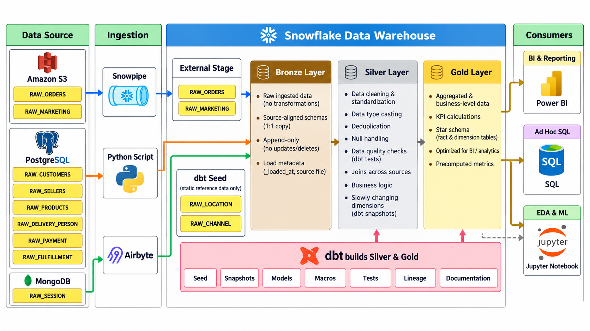
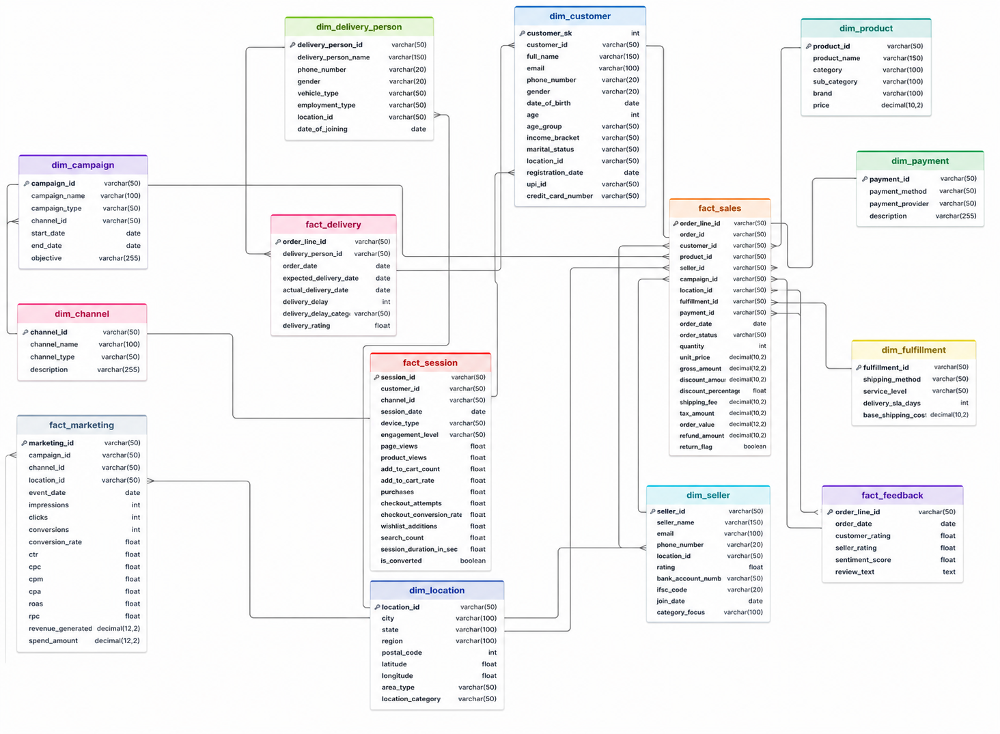
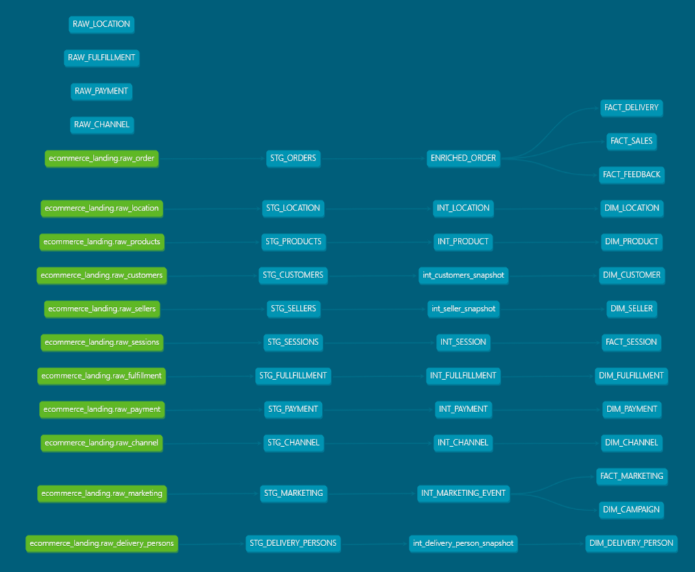

# E-commerce Analytics Platform Using Medallion Architecture

## Business Problem

E-commerce businesses generate data across dozens of siloed systems: order management, customer CRM, marketing platforms, delivery operations, and session tracking. Without a unified data platform, teams run into problems like these:

- **No single source of truth.** Marketing, operations, and finance each work from different numbers.
- **Slow insights.** Reports take days to put together by hand from disconnected systems.
- **Little understanding of customers.** Behaviour, lifetime value, and churn signals stay hidden unless the data is joined.
- **Wasted marketing spend.** You can't measure campaign ROI without linking spend to real conversions and revenue.
- **Operational blind spots.** Delivery SLA breaches and fulfilment failures go unnoticed until they turn into bigger problems.

I built this project to fix all of that. It is a centralised, automated, analytics ready data platform that brings 11 source tables from 3 different databases into a single Snowflake warehouse. Clean, governed, BI ready data is available within minutes of ingestion.

---

## Project Goals

| # | Goal | Outcome |
|---|------|---------|
| 1 | Bring all e-commerce data sources into one warehouse | Snowflake as the central platform |
| 2 | Automate ingestion from S3, PostgreSQL, and MongoDB | Snowpipe, Python, and Airbyte |
| 3 | Improve data quality step by step with Medallion Architecture | Bronze, Silver, and Gold layers |
| 4 | Build a governed, tested transformation layer | dbt models, tests, macros, and documentation |
| 5 | Produce analytics ready datasets in the Gold layer | Star schema fact and dimension tables |
| 6 | Surface KPIs in a self serve BI dashboard | Power BI `ECOMMERCE.pbix` |
| 7 | Enable ad hoc SQL analysis and EDA | SQL summaries and Jupyter notebooks |
| 8 | Lay the groundwork for ML and predictive analytics | scikit-learn experiments |

---

## Project Architecture



**How the data flows:**

1. **Raw data lands** in AWS S3 (orders, marketing), PostgreSQL (customers, sellers, products, delivery), and MongoDB (sessions).
2. **Snowpipe** reacts to new S3 files automatically, loads them through a Snowflake External Stage, and runs `COPY INTO` to fill the Bronze tables.
3. **Python scripts** extract the PostgreSQL tables (customers, sellers, products, delivery) and load them straight into the Bronze layer.
4. **Airbyte** syncs MongoDB session documents into the Bronze layer on a schedule.
5. **dbt Seeds** load the static lookup tables (location, channel, payment, fulfilment) into Bronze.
6. **dbt Silver models** clean, standardise, cast, and deduplicate the data and apply business logic.
7. **dbt Gold models** join data across domains, compute KPIs, and build the star schema.
8. **Power BI** connects to the Gold layer for dashboards, while Jupyter notebooks and SQL queries use Gold for EDA and ad hoc analysis.

## Tools & Technologies

| Category | Tools / Technologies | Purpose |
|---|---|---|
| **Architecture Type** | Modern ELT, Medallion Architecture (Bronze, Silver, Gold), cloud data platform | Scalable, layered architecture for data processing and analytics |
| **Data Sources** | AWS S3, PostgreSQL, MongoDB | Where the raw structured and unstructured data lives |
| **Ingestion** | Snowpipe, Airbyte, Python | Automated data ingestion and pipeline execution |
| **Staging Layer** | Snowflake External Stage | Landing zone for raw ingested data |
| **Data Warehouse** | Snowflake | Centralised cloud data warehouse |
| **Transformation** | dbt (Data Build Tool), SQL | Data transformation, modelling, and business logic |
| **Data Layers** | Bronze Layer | Raw, append only data |
| | Silver Layer | Cleaned, standardised, deduplicated data |
| | Gold Layer | Aggregated, analytics ready data |
| **Python Libraries** | pandas, NumPy, SQLAlchemy | Data manipulation, processing, and database connectivity |
| | matplotlib, seaborn | Data visualisation and EDA |
| | scikit-learn | Machine learning and predictive modelling |
| | requests | API integration and data fetching |
| **Data Modelling** | dbt Models, Seeds, Macros | Schema design and reusable transformations |
| **Data Quality** | dbt Tests | Data validation and integrity checks |
| **Orchestration Logic** | Python, SQL | Workflow logic and transformations |
| **Analytics & BI** | Power BI | Dashboards and reporting |
| **Ad Hoc Analysis** | SQL | Exploring the data with queries |
| **EDA & ML** | Jupyter Notebook | Exploratory data analysis and ML workflows |
| **Data Governance** | dbt Lineage, Documentation | Data lineage tracking and documentation |

## Raw Layer Data (Source Tables Overview)

| Category | Table Name | Key Fields / Attributes | Description |
|---|---|---|---|
| **Customer Data** | RAW_CUSTOMERS | CUSTOMER_ID, FIRST_NAME, LAST_NAME, EMAIL, PHONE_NUMBER, GENDER, DOB, LOCATION_ID | Customer demographic and personal information |
| **Order Data** | RAW_ORDERS | ORDER_ID, CUSTOMER_ID, PRODUCT_ID, QUANTITY, ORDER_DATE, STATUS, PAYMENT_ID | Transactional order level data |
| **Product Data** | RAW_PRODUCTS | PRODUCT_ID, PRODUCT_NAME, CATEGORY, SUB_CATEGORY, PRICE, BRAND | Product catalogue and pricing details |
| **Seller Data** | RAW_SELLERS | SELLER_ID, SELLER_NAME, EMAIL, PHONE_NUMBER, LOCATION_ID, RATING | Seller profiles and performance data |
| **Session Data** | RAW_SESSIONS | SESSION_ID, CUSTOMER_ID, CHANNEL_ID, PAGE_VIEWS, PRODUCT_VIEWS, ADD_TO_CART, PURCHASES | User interaction and behaviour tracking |
| **Marketing Data** | RAW_MARKETING | CAMPAIGN_ID, CHANNEL_ID, CLICKS, IMPRESSIONS, CONVERSIONS, REVENUE | Marketing campaign performance metrics |
| **Payment Data** | RAW_PAYMENT | PAYMENT_ID, PAYMENT_METHOD, PAYMENT_PROVIDER | Payment methods and providers |
| **Fulfilment Data** | RAW_FULFILLMENT | FULFILLMENT_ID, SHIPPING_METHOD, SERVICE_LEVEL, DELIVERY_SLA_DAYS, BASE_SHIPPING_COST | Shipping and fulfilment details |
| **Delivery Data** | RAW_DELIVERY | DELIVERY_PERSON_ID, NAME, PHONE_NUMBER, VEHICLE_TYPE, LOCATION_ID | Delivery personnel information |
| **Location Data** | RAW_LOCATION | LOCATION_ID, CITY, STATE, REGION, LATITUDE, LONGITUDE | Geographical and regional mapping data |
| **Channel Data** | RAW_CHANNEL | CHANNEL_ID, CHANNEL_NAME, CHANNEL_TYPE | Sales and marketing channel classification |

### Bronze Layer: Raw Ingestion Zone

The Bronze layer is the **system of record**. Data arrives exactly as it exists in the source, with no business logic, no filtering, and no transformation. Every ingested row is kept permanently, which gives full auditability and lets me replay transformations from scratch.

- Loaded through Snowpipe (S3), Python (PostgreSQL), Airbyte (MongoDB), and dbt Seeds (lookup tables)
- The schema mirrors the source system column for column
- Append only, so incremental loads never overwrite history

### Silver Layer: Cleansed and Conformed Zone

This is where **data quality is enforced**. Raw data is cleaned, standardised, and made safe for analytics. The main steps are:

- **Type casting:** converting strings to dates and decimals to proper numeric types
- **Null handling:** coalescing, flagging, or dropping records with missing values, depending on the business rules
- **Deduplication:** removing exact or near duplicate records with `ROW_NUMBER` window functions
- **Standardisation:** normalising gender codes, phone formats, and email casing
- **Business logic:** applying domain rules such as valid order statuses and active customer flags
- **SCD Type 2:** tracking historical changes to customer and seller records with dbt snapshots

### Gold Layer: Analytics Ready Zone

The Gold layer is the **business intelligence layer**. Data is aggregated in advance, joined, and optimised for query performance. Power BI, SQL analysts, and data scientists all read from this layer.

### Fact Tables

These fact tables capture the key business processes and measurable events:

| Fact Table | Purpose |
|---|---|
| `FACT_SALES` | Transactional sales and order level performance metrics |
| `FACT_SESSION` | Customer behaviour on the website and app |
| `FACT_MARKETING` | Campaign performance, conversions, and marketing ROI |
| `FACT_DELIVERY` | Delivery performance, SLA compliance, and logistics efficiency |
| `FACT_FEEDBACK` | Customer feedback, ratings, and sentiment metrics |

### Dimension Tables

Dimension tables hold the descriptive attributes used for slicing, filtering, and aggregating business insights.

| Dimension Table | Purpose |
|---|---|
| `DIM_CUSTOMER` | Customer demographic and profile information |
| `DIM_PRODUCT` | Product catalogue, pricing, and category details |
| `DIM_SELLER` | Seller profile and performance attributes |
| `DIM_LOCATION` | Geographic and regional mapping information |
| `DIM_CHANNEL` | Sales and marketing channel classification |
| `DIM_CAMPAIGN` | Marketing campaign metadata and tracking |
| `DIM_PAYMENT` | Payment methods and providers |
| `DIM_FULFILLMENT` | Shipping methods, SLA, and fulfilment information |
| `DIM_DELIVERY_PERSON` | Delivery personnel information and logistics tracking |

The schema supports these analytical areas:

* **Sales Analytics**
* **Marketing Performance**
* **Customer Behaviour Analytics**
* **Delivery and Logistics Monitoring**
* **Customer Feedback and Sentiment Analysis**

### Entity Relationship Diagram



## dbt Workflow

dbt is the **transformation engine** of this platform. All business logic lives in version controlled SQL, with no stored procedures and no black boxes.

### dbt Project Components

#### Models

dbt models are `.sql` files organised across three layers (Staging, Intermediate, and Mart) that map directly onto the Medallion Architecture:

```
ecommerce_dbt/models/
│
├── source/
│   └── source.yml                    -- dbt source definitions and freshness checks
│
├── staging/                          -- Bronze: mirrors the sources 1:1, type casting only
│   ├── STG_CHANNEL.sql
│   ├── STG_CUSTOMERS.sql
│   ├── STG_DELIVERY_PERSONS.sql
│   ├── STG_FULLFILLMENT.sql
│   ├── STG_LOCATION.sql
│   ├── STG_MARKETING.sql
│   ├── STG_ORDERS.sql
│   ├── STG_PAYMENT.sql
│   ├── STG_PRODUCTS.sql
│   ├── STG_SELLERS.sql
│   └── STG_SESSIONS.sql
│
├── intermediate/                     -- Silver: cleaned, deduplicated, enriched
│   ├── ENRICHED_ORDER.sql            -- Orders enriched with product, payment, and location
│   ├── ENRICHED_ORDER.yml
│   ├── INT_CHANNEL.sql
│   ├── INT_CHANNEL.yml
│   ├── INT_FULLFILLMENT.sql
│   ├── INT_FULLFILLMENT.yml
│   ├── INT_LOCATION.sql
│   ├── INT_LOCATION.yml
│   ├── INT_MARKETING_EVENT.sql
│   ├── INT_MARKETING_EVENT.yml
│   ├── INT_PAYMENT.sql
│   ├── INT_PAYMENT.yml
│   ├── INT_PRODUCT.sql
│   ├── INT_PRODUCT.yml
│   ├── INT_SESSION.sql
│   └── INT_SESSION.yml
│
└── mart/                             -- Gold: star schema, BI ready
    ├── Dim/                          -- Conformed dimension tables
    │   ├── DIM_CAMPAIGN.sql
    │   ├── DIM_CHANNEL.sql
    │   ├── DIM_CUSTOMER.sql
    │   ├── DIM_DELIVERY_PERSON.sql
    │   ├── DIM_FULFILLMENT.sql
    │   ├── DIM_LOCATION.sql
    │   ├── DIM_PAYMENT.sql
    │   ├── DIM_PRODUCT.sql
    │   ├── DIM_SELLER.sql
    │   └── DIM.yml
    └── Fact/                         -- Business fact tables
        ├── FACT_DELIVERY.sql
        ├── FACT_DELIVERY.yml
        ├── FACT_FEEDBACK.sql
        ├── FACT_FEEDBACK.yml
        ├── FACT_MARKETING.sql
        ├── FACT_MARKETING.yml
        ├── FACT_SALES.sql
        ├── FACT_SALES.yml
        ├── FACT_SESSION.sql
        └── FACT_SESSION.yml
```

#### Seeds

Seeds load **static lookup tables** from CSV files in version control straight into the Bronze layer, so no ingestion pipeline is needed:

| Seed File | Target Table | Contents |
|---|---|---|
| `RAW_LOCATION.csv` | `RAW_LOCATION` | City, state, region, and latitude/longitude mappings |
| `RAW_CHANNEL.csv` | `RAW_CHANNEL` | Channel names and type classifications |
| `RAW_PAYMENT.csv` | `RAW_PAYMENT` | Payment methods and provider names |
| `RAW_FULFILLMENT.csv` | `RAW_FULFILLMENT` | Shipping methods, SLA days, and base costs |

```bash
dbt seed  # Loads all 4 seed CSVs into the Snowflake Bronze layer
```

#### Macros

The project has **22 reusable Jinja SQL macros** that remove repetition across models and keep business logic consistent. Every marketing metric, financial calculation, and classification rule is defined once here and reused across the Intermediate and Mart layers:

| Macro | Purpose |
|---|---|
| `calculate_gross_amount` | Gross revenue: `quantity × price` |
| `calculate_net_amount` | Net revenue after discounts and refunds |
| `calculate_discount_amount` | Discount value applied to an order |
| `calculate_refund_amount` | Refund amount calculation |
| `calculate_tax_amount` | Tax calculation on order value |
| `calculate_order_value` | Final order level value |
| `calculate_ctr` | Click through rate: `clicks / impressions` |
| `calculate_cvr` | Conversion rate: `conversions / clicks` |
| `calculate_cpa` | Cost per acquisition |
| `calculate_cpc` | Cost per click |
| `calculate_cpm` | Cost per mille (1,000 impressions) |
| `calculate_roas` | Return on ad spend: `revenue / spend` |
| `calculate_rpc` | Revenue per click |
| `calculate_delay` | Delivery delay in days against the SLA |
| `calculate_age` | Customer age from date of birth |
| `age_category` | Age bucket classification (18–25, 26–35, …) |
| `gender_map` | Gender code standardisation (M/F → Male/Female) |
| `delivery_delay_category` | SLA breach severity classification |
| `return_flag` | Boolean flag for returned orders |
| `sentiment_category` | Feedback sentiment classification (Positive / Neutral / Negative) |
| `generate_schema_name` | Dynamic Snowflake schema resolution for each environment |

#### Tests

dbt tests enforce data quality contracts at every layer, using the real model names in this project.

**Test categories used:**

- `unique`: no duplicate primary keys across all Fact and Dimension tables
- `not_null`: required fields are populated in every Staging and Intermediate model
- `accepted_values`: status and category fields are checked against the expected values
- `relationships`: foreign keys resolve to valid parent records across models
- Custom tests: revenue stays positive, dates fall in a valid range, and delays are never negative

#### Lineage & Documentation

dbt generates a full **column level lineage graph** and a searchable documentation site:

```bash
dbt docs generate   # Build documentation
dbt docs serve      # Launch docs site on localhost:8080
```

Every model, column, test, and source is documented inline through `schema.yml` descriptions, so the data catalogue builds itself with no extra tooling.



#### Core dbt Commands

```bash
# Parse and validate project
dbt parse

# Run all transformations
dbt run

# Run specific model
dbt run -s stg_customers

# Run model and its dependents
dbt run -s +stg_customers+

# Full refresh (rebuild from scratch)
dbt run --full-refresh

# Run only tests
dbt test

# Run tests for specific model
dbt test -s stg_customers

# Generate documentation
dbt docs generate

# Serve documentation locally
dbt docs serve

# Check lineage and dependencies
dbt dag

# Run in production (with proper error handling)
dbt run --target prod --profiles-dir ~/.dbt

# Debug command (test connections, execute SQL)
dbt debug
```

#### Data Quality Testing

```bash
# Run all tests
dbt test

# Run with detailed output
dbt test --verbose

# Generate test report
dbt test --store-failures
```

---

## KPI Metrics

The Gold layer surfaces the following business KPIs, which Power BI and SQL analysts use directly:

### Revenue & Orders

| KPI | Definition |
|---|---|
| **Gross Revenue** | SUM(quantity × price) across all delivered orders |
| **Average Order Value (AOV)** | Gross Revenue / Total Orders |
| **Monthly Revenue Growth** | Month over month revenue change (%) |
| **Revenue by Category** | Revenue grouped by product category |
| **Revenue by Region** | Revenue grouped by customer region |

### Customer Metrics

| KPI | Definition |
|---|---|
| **Customer Lifetime Value (CLV)** | Total revenue per customer across all orders |
| **Customer Acquisition Rate** | New customers per month |
| **Repeat Purchase Rate** | Percentage of customers with 2 or more orders |
| **Churn Rate** | Percentage of customers with no order in the last 90 days |
| **Customer Age Distribution** | Cohort breakdown by age bucket |

### Marketing & Channel

| KPI | Definition |
|---|---|
| **Click-Through Rate (CTR)** | Clicks / Impressions |
| **Conversion Rate** | Conversions / Clicks |
| **Return on Ad Spend (ROAS)** | Revenue / Marketing Spend |
| **Cost per Conversion** | Total Spend / Conversions |
| **Revenue by Channel** | Revenue attributed to each marketing channel |

### Session & Funnel

| KPI | Definition |
|---|---|
| **Add-to-Cart Rate** | ADD_TO_CART / PRODUCT_VIEWS |
| **Purchase Conversion Rate** | PURCHASES / ADD_TO_CART |
| **Page Views per Session** | AVG(PAGE_VIEWS) |
| **Sessions by Channel** | Session count grouped by channel |

### Delivery & Fulfilment

| KPI | Definition |
|---|---|
| **On-Time Delivery Rate** | Orders delivered within SLA / Total delivered |
| **Average Delivery Days** | AVG(actual delivery days) |
| **SLA Breach Rate** | Orders exceeding DELIVERY_SLA_DAYS |
| **Delivery Cost per Order** | Total shipping cost / Orders shipped |

---

## SQL Analysis

The `*Summary/` folders hold the SQL scripts written for ad hoc business questions:

```
Order Summary/          → Revenue by period, order status breakdown, top products
Marketing Summary/      → Campaign ROI, channel attribution, ROAS by campaign
Session Summary/        → Funnel conversion rates, channel session quality
Delivery Summary/       → SLA compliance, delay analysis, delivery person ranking
Feedback Summary/       → Sentiment scoring, rating distribution, seller feedback
```

---

## Power BI Dashboard

The `ECOMMERCE.pbix` file connects to the Snowflake Gold layer and gives an executive dashboard with these pages:

| Dashboard Page | Key Visuals | Gold Tables Used |
|---|---|---|
| **Executive Overview** | Total revenue, AOV, order count, monthly trend | `FACT_SALES`, `DIM_CUSTOMER` |
| **Customer Analytics** | CLV distribution, repeat rate, churn, regional map | `DIM_CUSTOMER`, `DIM_LOCATION`, `FACT_SALES` |
| **Product Performance** | Category and sub category revenue, top products, brand ranking | `DIM_PRODUCT`, `FACT_SALES` |
| **Marketing & Channels** | CTR, ROAS, conversion funnel, campaign comparison | `FACT_MARKETING`, `DIM_CAMPAIGN`, `DIM_CHANNEL` |
| **Session Funnel** | Funnel from page views to product views, add to cart, and purchase | `FACT_SESSION`, `DIM_CHANNEL` |
| **Delivery Operations** | On time rate, SLA breaches, delivery person performance | `FACT_DELIVERY`, `DIM_DELIVERY_PERSON`, `DIM_FULFILLMENT` |
| **Seller Performance** | Seller ratings, order volume, revenue contribution | `DIM_SELLER`, `FACT_SALES` |
| **Customer Feedback** | Sentiment distribution, ratings by product and seller | `FACT_FEEDBACK`, `DIM_PRODUCT`, `DIM_SELLER` |

---

## EDA & Machine Learning

The `EDA/` folder holds Jupyter notebooks that cover the full analytical range.

### Exploratory Data Analysis

```
EDA/
├── 01_order_eda.ipynb        # Order volume trends, status distribution, revenue patterns
├── 02_delivery_eda.ipynb     # SLA compliance, delivery time distribution
├── 03_feedback_eda.ipynb     # Customer ratings, sentiment analysis, review trends
├── 04_session_eda.ipynb      # Funnel visualisation, channel performance, drop off rates
├── 05_marketing_eda.ipynb    # CTR, ROAS, campaign ROI analysis
```

## Learning Outcomes

Building this platform gave me practical experience across the modern data stack:

- **Medallion Architecture:** knowing when and how to apply each layer's transformation approach in production
- **Snowflake internals:** External Stages, Snowpipe auto ingest, storage integrations, warehouse sizing, clustering, and result caching
- **dbt in depth:** models, seeds, macros, tests, snapshots, incremental materialisation, lineage, and documentation generation
- **ELT design across several sources:** combining event based triggers (Snowpipe), connectors (Airbyte), and custom code (Python) into one coherent ingestion design
- **Star schema modelling:** designing fact and dimension tables that balance query performance with analytical flexibility
- **SCD Type 2:** preserving dimensional history with dbt snapshots
- **Data quality as code:** building tests into the transformation layer instead of adding them as an afterthought
- **Analytics engineering mindset:** bridging data engineering (pipelines) and data analysis (business logic in SQL)
- **Python for data engineering:** using pandas, SQLAlchemy, and requests for custom connectors and EDA
- **ML experimentation:** applying scikit-learn to business problems (churn, CLV, delay prediction) with features built in the warehouse